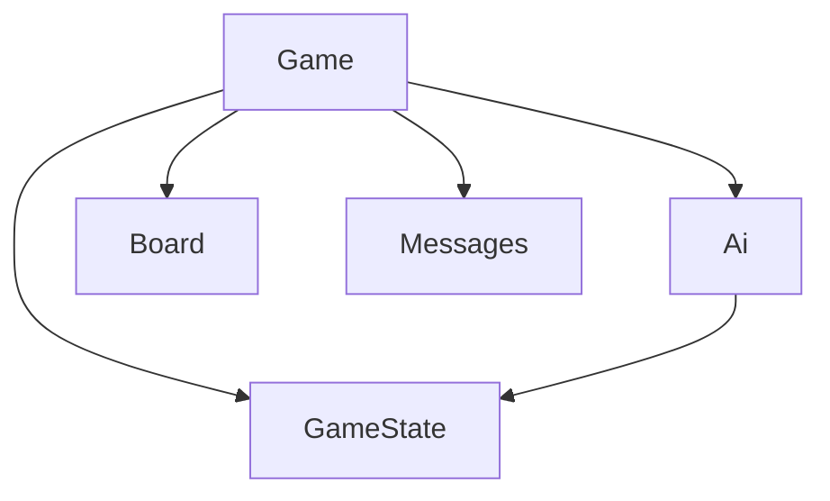

TicTacToe Game

This application runs over go1.15.7 darwin/amd64


```mermaid
graph TD;
    Game --> GameState;
    Game --> Ai;
    Game --> Board
    Game --> Messages
    Ai --> GameState
```

To run, build first:
```
go build
```
and, execute:
```
./gamesys-tictactoe
```

Note: the project must be inside $GOPATH/src
